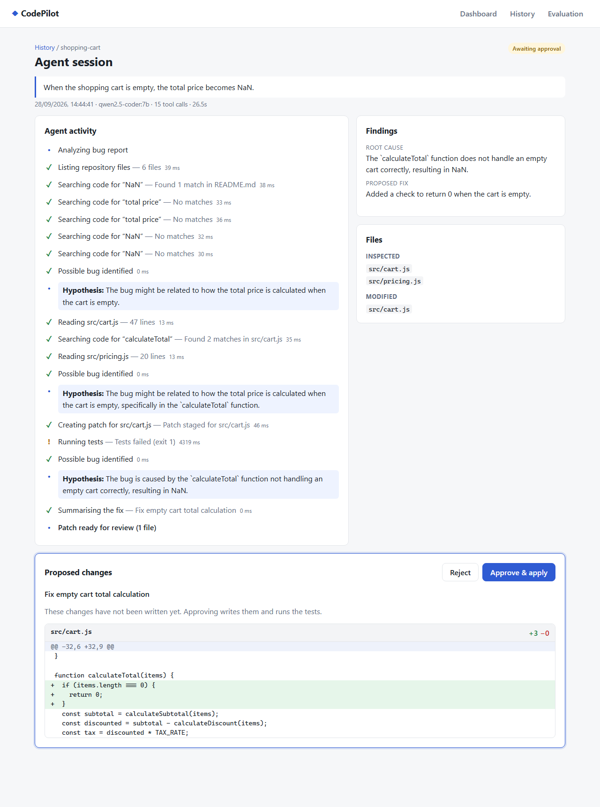
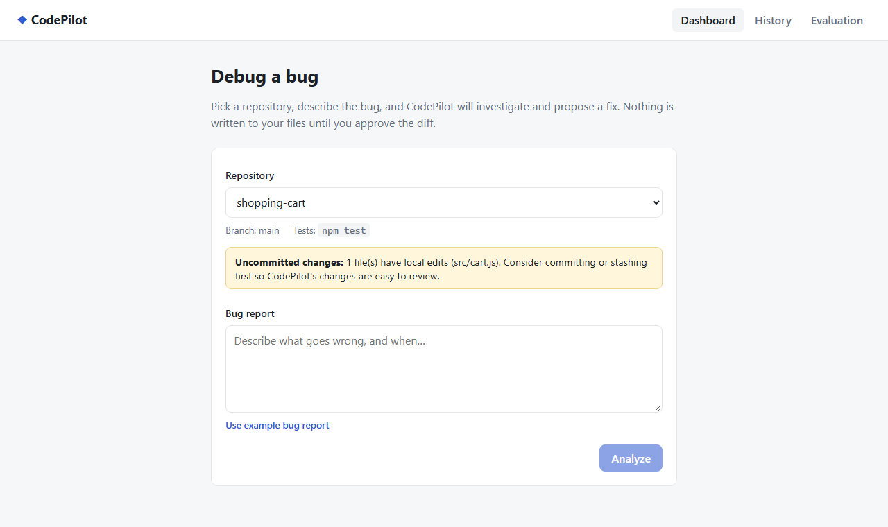
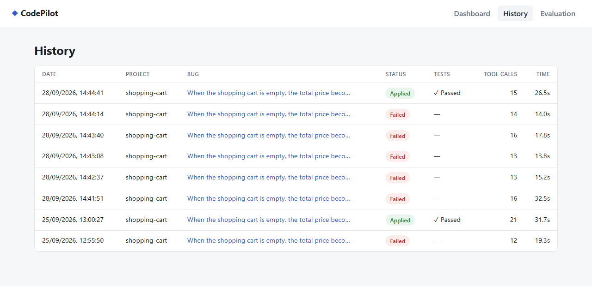
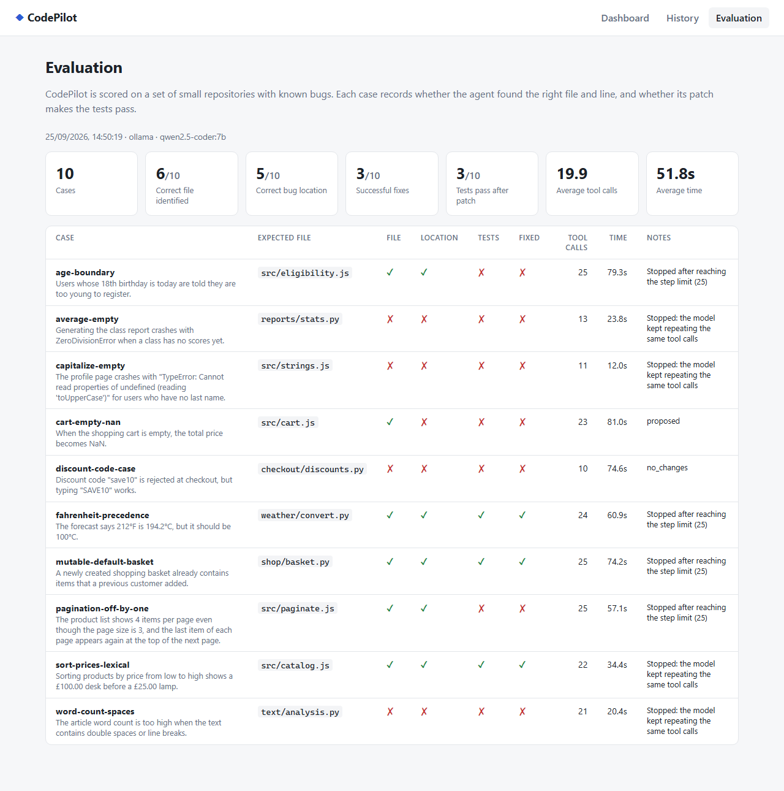
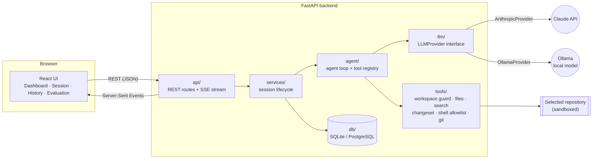
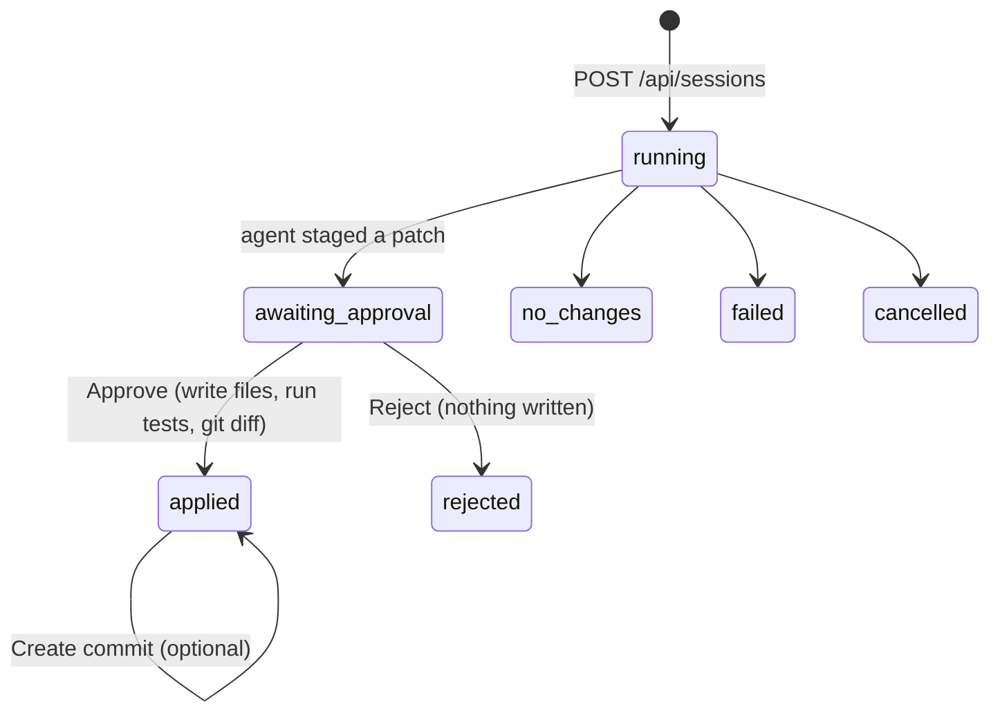

# CodePilot

[](https://github.com/JoniXCC/CodePilot/actions/workflows/ci.yml)
[](LICENSE)

**A local AI debugging agent that reads a bug report, investigates a real repository, proposes a fix as a Git diff, and only touches your files after you approve.**

CodePilot is a full-stack portfolio project: a FastAPI backend runs an LLM agent loop over a set of *sandboxed* tools (file reading, code search, whitelisted test commands, Git). A React UI streams what the agent is doing in real time, shows the proposed patch for review, applies it on approval, runs the tests and can create a commit. An evaluation harness scores the agent on a benchmark of repositories with known bugs.

### Screenshots

*From a real run with a local model (`qwen2.5-coder:7b` via Ollama) — not a mock-up.*

**Agent session** — live activity timeline, findings, and the proposed patch waiting for approval:



| Dashboard | History |
|---|---|
|  |  |

**Evaluation** — the benchmark results page:



---

## Features

- **Agent loop with tool calling** — the model chooses from 11 tools (`list_files`, `read_file`, `search_code`, `write_file`, `replace_code`, `run_command`, `run_tests`, `get_git_diff`, `git_status`, `record_hypothesis`, `finish`).
- **Human-in-the-loop edits** — every edit is *staged* in memory and shown as a unified diff. Nothing is written until you click **Approve**.
- **Live activity timeline** — tool calls stream to the browser via Server-Sent Events, as short action summaries (never the model's hidden reasoning).
- **Security by construction** — path-traversal and symlink protection, secret-file blocking, a command allowlist with per-command flag rules, and credential-free child processes.
- **Git integration** — warns about uncommitted changes, shows the final `git diff` after applying, and offers an optional **Create commit** with an AI-suggested message (never automatic).
- **Session history** — every run (actions, files inspected/modified, diff, test results, status) is stored in SQLite via SQLAlchemy (PostgreSQL-ready).
- **Evaluation harness** — 10 broken repositories (JavaScript + Python) with expected file, bug location and test; measures file/location accuracy, fix success, tool calls and time, with anti-cheating checks.
- **Swappable LLM providers** — the agent depends on an `LLMProvider` interface with two real implementations: **Claude** (Anthropic API) and **local models via Ollama** (free, runs on your GPU), plus a scripted fake that makes the whole system testable offline.
- **191 automated tests**, including dedicated security tests.

## Tech stack

| Layer | Technology |
|---|---|
| Backend | Python 3.12+, FastAPI, Pydantic v2, SQLAlchemy 2, Uvicorn |
| AI | Anthropic Claude (official `anthropic` SDK) or local models via Ollama, behind one provider interface |
| Frontend | React 19, TypeScript, Vite, React Router |
| Data | SQLite (default), PostgreSQL-compatible via `DATABASE_URL` |
| Tooling | pytest, Git, Docker / Docker Compose, nginx |

## Architecture



### Session lifecycle



### Project layout

```
backend/app/
  main.py            FastAPI app factory (dependency wiring, error handlers)
  config.py          settings from environment variables
  api/               thin HTTP layer: projects, sessions (+ SSE), evals
  services/          session lifecycle, project discovery, repo copies
  agent/             loop.py (agent loop), registry.py, toolset.py, prompts.py, events.py
  tools/             workspace.py (path guard), files, search, changeset, shell, git
  llm/               base.py (interface), anthropic_provider.py, ollama_provider.py, scripted_provider.py, factory.py
  db/                SQLAlchemy engine, models, repository (all queries)
  evaluation/        benchmark runner, metrics, case loader
frontend/src/        pages/, components/ (Timeline, DiffViewer…), hooks/useSessionEvents.ts, api/
examples/            shopping-cart: the demo project with a deliberate bug
eval/cases/          10 benchmark cases (case.yaml + repo/)
```

## How the agent works

1. **You pick a repository and describe the bug**, e.g. *"When the shopping cart is empty, the total price becomes NaN."*
2. The backend creates a session and starts the **agent loop** in a worker thread:
   - send the conversation + tool definitions to the LLM;
   - the LLM replies with one or more **tool calls** (structured JSON);
   - each call is validated against a Pydantic model, executed by the sandboxed tool, logged, and turned into a timeline event;
   - the results go back to the LLM; repeat until it calls `finish` (or a step limit is hit).
3. The agent typically searches the code, reads the relevant files, runs the tests to reproduce the bug, records a **hypothesis**, stages a minimal patch with `replace_code`, and calls `finish` with a summary, root cause and explanation.
4. The UI shows the proposed diff. **Approve** writes the files (refusing if they changed on disk in the meantime), runs the test suite and shows the final `git diff`. **Reject** discards the patch.
5. Optionally, **Create commit** asks the LLM for a commit message, lets you edit it, and commits only the modified files.

For the demo bug, the cause is two calls away from where the symptom appears: `getBulkDiscountRate(0)` finds no discount tier and returns `undefined`, so `subtotal * undefined` is `NaN`. The fix is a one-line `?? 0`.

## Security design

The LLM's tool arguments are treated as **untrusted input**. Safety is enforced in code, not by asking the model nicely.

| Threat | Mitigation | Where |
|---|---|---|
| Reading/writing outside the repo (`../../etc/passwd`, absolute paths, `C:foo`) | Every path is resolved with `Path.resolve()` **first** (collapsing `..` and following symlinks), then must be inside the repo root | `tools/workspace.py` |
| Symlink / NTFS junction escapes | Same resolve-then-check; directory walks re-validate every file | `tools/workspace.py`, `tools/files.py` |
| Leaking secrets | `.env*`, `*.pem`, `*.key`, `id_rsa*`, `.npmrc`… are blocked unless explicitly allowed; `.git/` internals are blocked; secret files never appear in listings, search or diffs | `tools/workspace.py` |
| Arbitrary shell commands (`rm -rf`, `curl`, `sudo`, `pip install`) | **Allowlist**, not blocklist: `npm test`, `npm run test`, `npm run lint`, `pytest`, `python -m pytest`, `git diff`, `git status` | `tools/shell.py` |
| Command chaining (`;`, `&&`, `\|`, `$(…)`, redirects) | Metacharacters rejected; commands run with `shell=False` | `tools/shell.py` |
| Dangerous flags on allowed commands (`git diff --output=…`, `pytest -p plugin`) | Per-command flag allowlists; path arguments must stay in the repo | `tools/shell.py` |
| Credential exfiltration via test scripts | Child processes get an environment with `*KEY*`, `*TOKEN*`, `*SECRET*`, `*PASSWORD*` variables removed | `tools/shell.py` |
| Unreviewed edits | Edits are staged in a `ChangeSet`; files are written only after approval, with a conflict check | `tools/changeset.py` |
| Prompt injection from repo files | System prompt tells the model tool output is data, not instructions; the sandbox limits the damage regardless | `agent/prompts.py` |
| Sensitive data in logs | Structured JSON logs record tool name, duration, success and error only — never file contents; API-key patterns are redacted | `agent/registry.py`, `logging_config.py` |
| Browser choosing arbitrary folders | The API only opens direct children of `PROJECTS_DIR` | `services/projects.py` |

> **Important caveat:** `npm test` / `pytest` execute the target repository's own code. CodePilot only runs tests on code that is already on disk (i.e. *your* code, or a patch you approved), but you should still only point it at repositories you trust.

## Setup

**Requirements:** Python 3.12+, Node.js 20+, Git. For live agent runs, either an Anthropic API key **or** [Ollama](https://ollama.com) for a free local model (tests and the reference evaluation need neither).

### Choosing an LLM provider

| | Claude (`LLM_PROVIDER=anthropic`) | Local model (`LLM_PROVIDER=ollama`) |
|---|---|---|
| Cost | Pay per token (a demo run is cents) | Free |
| Setup | API key in `.env` | Install Ollama, then `ollama pull qwen2.5-coder:7b` |
| Hardware | None | ~8 GB GPU VRAM recommended for 7–8B models (CPU works, slowly) |
| Quality | Strong multi-step tool use | Weaker; expect a lower benchmark score |
| Privacy | Code is sent to the API | Code never leaves your machine |

Switching is one line in `.env` — no code changes, which is the point of the `LLMProvider` interface.

```bash
# 0. Get the code
git clone https://github.com/JoniXCC/CodePilot.git
cd CodePilot

# 1. Configuration
cp .env.example .env          # then set ANTHROPIC_API_KEY, or LLM_PROVIDER=ollama

# 2. Backend
cd backend
python -m venv .venv
.venv/Scripts/activate        # Windows  (macOS/Linux: source .venv/bin/activate)
pip install -e ".[dev]"
python -m app.demo            # creates demo-projects/shopping-cart as a git repo
uvicorn app.main:create_app --factory --reload --port 8000

# 3. Frontend (new terminal)
cd frontend
npm install
npm run dev                   # http://localhost:5173
```

> **Windows PowerShell:** if `npm` fails with *"running scripts is disabled on this system"*, use `npm.cmd run dev` instead.

Run `python -m app.demo` again at any time to reset the demo project to its buggy state.

You can also drive the agent from the terminal:

```bash
python -m app.cli ../demo-projects/shopping-cart "When the shopping cart is empty, the total price becomes NaN." --apply
```

### Environment variables

| Variable | Default | Purpose |
|---|---|---|
| `LLM_PROVIDER` | `anthropic` | `anthropic` or `ollama` |
| `ANTHROPIC_API_KEY` | — | Claude API key (never logged, stripped from child processes) |
| `ANTHROPIC_MODEL` | `claude-opus-5` | Model ID, e.g. `claude-sonnet-5` for lower cost |
| `ANTHROPIC_EFFORT` | `high` | `low` · `medium` · `high` · `xhigh` · `max` — thoroughness vs. cost/latency |
| `OLLAMA_BASE_URL` | `http://localhost:11434` | Where the Ollama server listens |
| `OLLAMA_MODEL` | `qwen2.5-coder:7b` | Any Ollama model that supports tool calling |
| `OLLAMA_NUM_CTX` | `16384` | Context window; Ollama's small default is too little for tool schemas + source files |
| `PROJECTS_DIR` | `demo-projects` | Folder whose sub-folders are the repositories CodePilot may open |
| `DATABASE_URL` | `sqlite:///<project>/codepilot.db` | Any SQLAlchemy URL, e.g. `postgresql+psycopg://…` |
| `AGENT_MAX_STEPS` | `25` | Upper bound on agent loop iterations |
| `COMMAND_TIMEOUT_SECONDS` | `120` | Timeout for test/command runs |
| `LOG_LEVEL` | `INFO` | Structured log level |

### Running the tests

```bash
cd backend
python -m pytest -q          # 191 tests; JavaScript cases are skipped if npm is missing
cd ../frontend
npm run build                # type-check + production build
```

## Running with Docker

```bash
cp .env.example .env                 # add your ANTHROPIC_API_KEY
mkdir -p demo-projects
docker compose build
docker compose run --rm backend python -m app.demo   # create the demo repository
docker compose up
```

- UI: http://localhost:8080 (nginx serves the built React app and proxies `/api` to the backend, with buffering disabled for SSE)
- API docs: http://localhost:8000/docs
- `./demo-projects` is mounted as `/projects` — it is the **only** host folder the agent can see.
- With `LLM_PROVIDER=ollama`, the container talks to Ollama on your host via `host.docker.internal`.

> The Docker setup has been written but not yet verified on a machine with Docker installed.

## Evaluation methodology

Generating a patch is easy; knowing whether it's *right* is the interesting part. `eval/cases/` holds 10 small repositories, each with one known bug:

| Case | Language | Bug type |
|---|---|---|
| `cart-empty-nan` | JS | `undefined` propagating into arithmetic → `NaN` |
| `pagination-off-by-one` | JS | off-by-one slice bound |
| `capitalize-empty` | JS | crash on empty string |
| `sort-prices-lexical` | JS | string comparison of numbers |
| `age-boundary` | JS | `>` instead of `>=` at a boundary |
| `average-empty` | Python | `ZeroDivisionError` on empty input |
| `mutable-default-basket` | Python | shared mutable default argument |
| `fahrenheit-precedence` | Python | operator precedence |
| `word-count-spaces` | Python | `split(" ")` vs `split()` |
| `discount-code-case` | Python | case-sensitive lookup |

Each `case.yaml` defines the bug report, the **expected file**, the **expected line range**, the **test that must pass**, the test command, protected paths, and a reference fix.

For every case the runner:

1. copies the repository into a fresh Git repo and runs the tests — **the case must fail first** (proves the bug reproduces);
2. runs the agent exactly as the app does (edits are staged);
3. scores **correct file** (the expected file was modified) and **correct location** (a changed hunk overlaps the expected lines, ±2);
4. applies the patch, **restores the protected test files from Git** (so "fixing" the tests doesn't count), and re-runs the tests;
5. counts a **successful fix** only if the suite passes *and* the expected test actually ran *and* no protected file was modified.

It also records tool calls, wall-clock time and token usage. Results are written to `eval/results/` and shown on the Evaluation page.

```bash
cd backend
python -m app.evaluation --reference   # harness check with the known fixes (no API key)
python -m app.evaluation               # score the configured LLM
python -m app.evaluation --cases age-boundary,average-empty
```

The harness itself is tested with **negative controls**: an agent that does nothing scores 0, an agent that edits the tests is caught, and a fix in the wrong place is reported as such.

### Example results

Reference run (harness validation; applies the known fixes, so a perfect score is expected — it proves every case reproduces and is solvable):

```
Agent Evaluation
Provider: reference
Cases: 10
Correct file identified: 10/10
Correct bug location: 10/10
Successful fixes: 10/10
Tests passed after patch: 10/10
Average tool calls: 5.0
```

**Local model: `qwen2.5-coder:7b` via Ollama** (RTX 4060 Laptop, 8 GB; single run, temperature 0.2):

```
Agent Evaluation
Provider: ollama (qwen2.5-coder:7b)
Cases: 10
Correct file identified: 6/10
Correct bug location: 5/10
Successful fixes: 3/10
Tests passed after patch: 3/10
Average tool calls: 19.9
Average time: 51.8s
```

What the failures show (this is the useful part of an evaluation):

- **Repetition loops** — the 7B model often re-issued the same search after it returned nothing. The agent loop now refuses identical repeat calls and stops a run after 5 of them; 4 runs ended this way.
- **Step-limit exhaustion** — 4 runs hit the 25-step limit. Two of them (`fahrenheit-precedence`, `mutable-default-basket`) had already staged a correct fix, so the patch still counted.
- **Right file, wrong fix** — in `age-boundary` and `pagination-off-by-one` it found the exact lines but never staged a working patch; in `cart-empty-nan` it patched the symptom (early return in `calculateTotal`) instead of the cause.
- **Prose instead of tool calls** — small models often describe the next call in text; `OllamaProvider` recovers JSON tool calls from the reply, and the loop nudges the model when it stops without calling `finish`. Both were added after observing these failures.

Results vary between runs: the cart bug was fixed in one manual run but not in the evaluation run, and while capturing the screenshots above it took 6 attempts to get a patch (5 runs ended in repetition loops). A single 10-case run is indicative, not a precise score.

**Claude:** *not yet recorded.* Set `LLM_PROVIDER=anthropic` plus an API key and run `python -m app.evaluation` to compare.

## Key concepts (interview notes)

- **Agent loop** — a loop where the LLM repeatedly chooses an action (tool call), our code executes it, and the result is fed back, until the task is done. Lets the model gather information step by step instead of guessing. → `agent/loop.py`
- **Tool calling** — tools are described to the model as JSON schemas; the model returns structured calls instead of prose. Our code performs the action, so every action passes through our validation and sandbox. → `agent/registry.py`, `agent/toolset.py`
- **LLM provider abstraction** — the agent depends on the `LLMProvider` interface, not on a vendor SDK. Adding Ollama meant one new file plus one line in the factory — the agent, tools and API were untouched. → `llm/base.py`, `llm/ollama_provider.py`
- **Dependency injection** — objects receive their collaborators (`Agent(provider, registry, on_event)`, `create_app(settings, provider_factory)`, FastAPI `Depends`) instead of constructing them, which is what makes the scripted-provider tests possible. → `main.py`, `api/deps.py`
- **Path traversal protection** — resolve the real path (following `..` and symlinks) *then* check it's inside the allowed root; checking the raw string is bypassable. → `tools/workspace.py`
- **Allowlist vs. blocklist** — list the few permitted commands and fail closed, rather than trying to enumerate every dangerous one. → `tools/shell.py`
- **REST endpoints & SSE** — REST for request/response actions (create session, approve); Server-Sent Events for one-way live updates from server to browser. Events are persisted, so a reconnecting browser resumes via `Last-Event-ID`. → `api/sessions.py`, `hooks/useSessionEvents.ts`
- **Async vs. threads** — FastAPI serves requests on an async event loop; the agent's blocking work (LLM calls, subprocesses) runs in a thread pool so it never blocks the server. → `services/session_service.py`
- **Git diff** — a unified diff lists changed lines with `-`/`+` prefixes and `@@` hunk headers; CodePilot builds one for staged edits (`difflib`) and reads the real one from Git after applying. → `tools/changeset.py`, `tools/git.py`

## Known limitations

- Tests execute the target repository's code; the sandbox restricts the *agent*, not the code under test. A container per session would be stronger isolation.
- The agent cannot run tests against its *staged* patch before you approve it — verification happens after approval.
- Only repositories directly inside `PROJECTS_DIR` can be selected.
- Two providers (Anthropic, Ollama) are implemented; others need a new `LLMProvider` subclass. Small local models sometimes write tool calls as plain JSON text; `OllamaProvider` recovers those, but they are less reliable at long tool-use chains.
- The benchmark is small and single-bug-per-repo; real-world bugs are messier.
- SQLite schema is created with `create_all` (no migrations yet); timeline streaming polls the database every 0.4 s.

## Future improvements

- Run staged patches in a throwaway copy/container so the agent can verify its own fix before asking for approval.
- Alembic migrations and a PostgreSQL service in Docker Compose.
- More providers (e.g. OpenAI) and a published Claude-vs-local-model comparison on the benchmark.
- Larger, more realistic evaluation set (multi-file bugs, flaky tests), multiple runs per case for variance.
- Per-session token/cost reporting in the UI and prompt caching for repeated context.
- Authentication for multi-user deployments.
